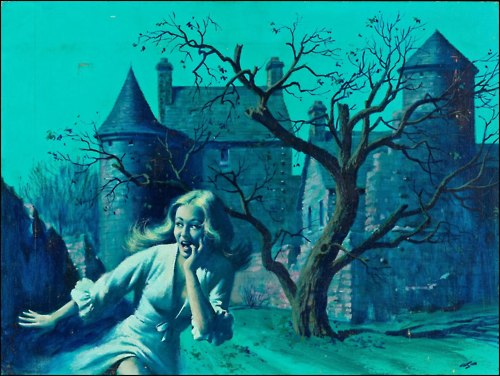
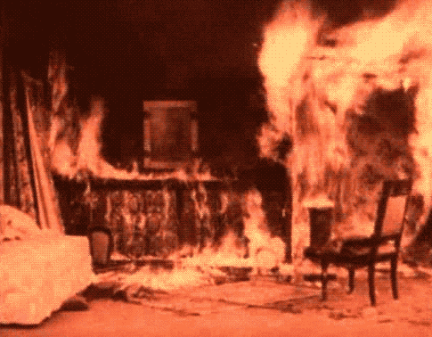
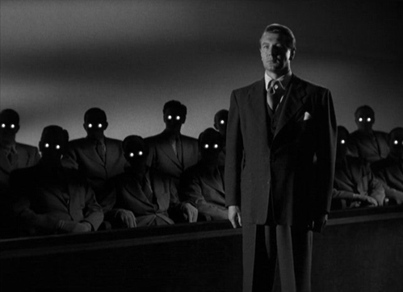

<!--
<link rel="preconnect" href="https://fonts.googleapis.com">
<link rel="preconnect" href="https://fonts.gstatic.com" crossorigin>
<link href="https://fonts.googleapis.com/css2?family=Playfair+Display:ital,wght@0,400..900;1,400..900&display=swap" rel="stylesheet">
<link rel="preconnect" href="https://fonts.googleapis.com">
<link rel="preconnect" href="https://fonts.gstatic.com" crossorigin>
<link href="https://fonts.googleapis.com/css2?family=EB+Garamond:ital,wght@0,400..800;1,400..800&display=swap" rel="stylesheet">
<link rel="preconnect" href="https://fonts.googleapis.com">
<link rel="preconnect" href="https://fonts.gstatic.com" crossorigin>
<link href="https://fonts.googleapis.com/css2?family=Libre+Baskerville:ital,wght@0,400;0,700;1,400&display=swap" rel="stylesheet">
<link rel="preconnect" href="https://fonts.googleapis.com">
<link rel="preconnect" href="https://fonts.gstatic.com" crossorigin>
<link href="https://fonts.googleapis.com/css2?family=Cormorant+Garamond:ital,wght@0,300;0,400;0,500;0,600;0,700;1,300;1,400;1,500;1,600;1,700&display=swap" rel="stylesheet">
-->
<link href="https://fonts.googleapis.com/css2?family=Cormorant+Garamond:ital,wght@0,300&display=swap" rel="stylesheet">

-   [Escape From
    Freedom](#escape-from-freedom){#toc-escape-from-freedom}
    -   [Chapter 1 - Freedom: A Psychological
        Problem](#chapter-1---freedom-a-psychological-problem){#toc-chapter-1---freedom-a-psychological-problem}
    -   [Chapter 2 - The Emergence of the Individual and the Ambiguity
        of
        Freedom](#chapter-2---the-emergence-of-the-individual-and-the-ambiguity-of-freedom){#toc-chapter-2---the-emergence-of-the-individual-and-the-ambiguity-of-freedom}
    -   [Chapter 3 - Freedom in the Age of the
        Reformation](#chapter-3---freedom-in-the-age-of-the-reformation){#toc-chapter-3---freedom-in-the-age-of-the-reformation}
        -   [Medieval
            Background](#medieval-background){#toc-medieval-background}
        -   [Period of the
            Reformation](#period-of-the-reformation){#toc-period-of-the-reformation}
    -   [Chapter 4 - Two Aspects of Freedom for Modern
        Man](#chapter-4---two-aspects-of-freedom-for-modern-man){#toc-chapter-4---two-aspects-of-freedom-for-modern-man}
        -   [Selfishness](#selfishness){#toc-selfishness}
    -   [Chapter 5 - Mechanisms of
        Escape](#chapter-5---mechanisms-of-escape){#toc-chapter-5---mechanisms-of-escape}
        -   [Authoritarianism](#authoritarianism){#toc-authoritarianism}
        -   [Masochistic
            Strivings](#masochistic-strivings){#toc-masochistic-strivings}
        -   [Sadistic
            Strivings](#sadistic-strivings){#toc-sadistic-strivings}
        -   [Masochistic Bonds vs Primary
            Bonds](#masochistic-bonds-vs-primary-bonds){#toc-masochistic-bonds-vs-primary-bonds}
        -   [Sadistic Drives](#sadistic-drives){#toc-sadistic-drives}
        -   [Destructiveness](#destructiveness){#toc-destructiveness}
        -   [Automaton
            Conformity](#automaton-conformity){#toc-automaton-conformity}
    -   [Chapter 6 - Psychology of
        Nazism](#chapter-6---psychology-of-nazism){#toc-chapter-6---psychology-of-nazism}
    -   [Chapter 7 - Freedom +
        Democracy](#chapter-7---freedom-democracy){#toc-chapter-7---freedom-democracy}
        -   [How Culture Fosters Automaton
            Conformity](#how-culture-fosters-automaton-conformity){#toc-how-culture-fosters-automaton-conformity}
        -   [Freedom and
            Spontaneity](#freedom-and-spontaneity){#toc-freedom-and-spontaneity}

# Escape From Freedom

{:.no_toc}

[Home](../index.html)

{:toc}

## Chapter 1 - Freedom: A Psychological Problem

{:.imgR}

-   Freud was first to direct attention to the irrational aspects which
    determine behavior.
-   The Basic Mechanism: Man is fundamentally anti-social (because of
    unconscious drives.
-   Culture suppresses these drives: it *sublimates* them into
    culturally valuable strivings.
-   If the suppression is greater than the capacity for sublimation,
    neuroses appear.
-   Fromm: Contrary to Freud, who saw key problem of psychology was the
    satisfaction of instinctual needs, Fromm sees key problem as the
    individual's relatedness of individual towards world
-   Man is not just a collection of drives apart from the world: Lust
    for power, yearning for submission, enjoyment of sexual pleasure,
    love + hate are all products of social process.
-   This is a *dynamic* process: passions, desires, anxieties change and
    develop as a result of the social process, Man's energies thus
    shaped into their specific forms become productive forces, molding
    the social process.
-   What factors influence Man's adaptiveness?
    -   Physical Needs force him to work in a social system.
    -   Need for relatedness, belongingness, and escape from isolation
        and sense of insignificance.

## Chapter 2 - The Emergence of the Individual and the Ambiguity of Freedom

-   Freedom To(Possibility/Anxiety + Powerlessness) vs Freedom
    From(Aloneness/Independence).
-   Primary Ties - those tied before process of individuation.
-   Individuation requires separation.
-   When these two processes are in sync, i.e. as each primary tie is
    loosened the individual matches it with a newfound strength + sense
    of self, there is a harmonious development of self.
-   When the development of individuation lags behind the sense of
    separation, this leads to an unbearable sense of
    isolation/powerlessness, which in turn leads to the *mechanisms of
    escape*.
-   The process of development is mirrored in the development of a
    culture through history (a la Hegel).
-   And in the history of the development of civilization, every step in
    the development of the individual has threatened people with new
    insecurities, as each step has resulted in a loss of security.

## Chapter 3 - Freedom in the Age of the Reformation

### Medieval Background

{:.imgL}

-   Lack of individual freedom: social class + trades were essentially
    fixed.
    -   This structure gave security: social order was a natural order -
        one's position was guaranteed.
    -   This structure was transformed by a sudden increase in capital
-   Individual initiative and competition became more important
    -   Class stratification gave way to newfound wealth.
    -   Men became individuals, distinct from their social roles.
    -   The new moneyed class was able to substitute wealth for rank,
        creating their own position in society
-   At the same time peasants became the urban masses to be exploited.
-   While gaining wealth and security, the lost security and sense of
    belonging, an increased feeling of strength at the same time
    increased isolation, doubt, skepticism, anxiety.
    -   This explains the craving for *fame* that emerged during the
        Renaissance

#### Ethics of Money in Flux

-   Ethical views involving economic activity in medieval society:
    -   economic interests subordinate to the real business of life:
        salvation.
-   Limits and restrictions against allowing economic interests to
    interfere with serious affairs.
-   Avarice was a sin.
-   In late middle ages, stability of social classes undermined by
    capital
    -   Wealth increasingly became a measure of status.
-   Concept of time in modern sense began to develop
    -   Clocks began to strike quarter hours.
-   Work became a supreme value
-   Efficiency became a moral virtue

#### The Growth of Anomie

-   A growing restlessness pervaded life
-   The individual was left alone,
    -   Everything depended on his effort
    -   Not on the security of his traditional status.
-   Even for the more fortunate, increasing role of Capital, the Market,
    and Competition change personal situation into one of insecurity,
    isolation, and anxiety.
-   During feudal period, co-operation was regulated + regimented by
    rules which curbed competition.
-   When this began to break down with the rise of capitalism, it
    dissolved the collective bonds.
-   So while man is freed from bondage of economic ties; at the same
    time, "Life has ceased to be lived in a closed world with man at the
    center; the world has become limitless + threatening"
    -   He is threatened by powerful supra-personal forces: Capital and
        the Market.
    -   His relationship to other men has become hostile + estranged
    -   He is overwhelmed with a sense of individual helplessness +
        nothingness.
-   This new freedom creates a sense of insecurity, powerlessness,
    doubt, aloneness, and anxiety
    -   These feelings must be alleviated if he is to function
        successfully.

### Period of the Reformation

{:.imgR}

-   Protestantism + Calvinism emerged, to give expression to this new
    freedom while offering an escape from its burden.
-   2 Key differences between catholic + new theocracy:
    1.  Problem of human dignity
    2.  Effect of mans actions on his fate
-   Medieval church stressed
    -   Dignity of man
    -   Freedom of will
    -   Efficacy of his efforts at salvation
    -   Likeness between god and man,
    -   Confidence he could have in god's love.
-   Luther stressed man's helplessness + powerlessness
    -   Our nature is inherently + irredeemably evil, and nothing we do
        can alter this.
    -   Said that man has no free will, his will is ruled entirely by
        god or satan.
    -   He had an "authoritarian character" - love for authority +
        hatred of powerless
-   Once individual lost sense of pride + dignity, he was prepared to
    accept a role in which his life was a means to purposes outside
    himself (i.e. economic productivity)
    -   Luther's theology gave expression to individuals feeling of
        individual insignificance + helplessness.
-   Luther saw only way man could have certainty of salvation was
    through faith.
    -   This desire for certainty is connected with the pervading
        irrational doubt through elimination of of the individual self
        and absolute submission to a higher power.
-   But in rebelling against the church's authority, he also gave
    expression to positive aspects of freedom
    -   The irrational doubt can't be curred by rational answers, it can
        only disappear if the individual becomes a part of a meaningful
        world.
    -   The quest for certainty is rooted in the need to conquer the
        unbearable doubt.
    -   Luther's solution parallels the move by many individuals to
        escape uncertainty by submission to an all-powerful force (and
        thus eliminating their individuality)
-   *The need to silence doubt had a most powerful stimulus in the
    development of modern philosophy and science.*
-   Our attempts to silence doubt - (success, consumption, science,
    submission) can only eliminate *awareness* of doubt - never doubt
    itself.
    -   This can only be overcome by finding a meaningful place in the
        world.
-   The picture of man Luther drew in religious terms - isolated,
    doubtful, and anxious - matched the situation of the individual
    brought about by social + economic evolution.
-   But Luther's solution was in annihilation of individual self +
    absolute submission as condition of salvation.
-   He expressed an awe for authority and a hatred of the powerlesss
    rabble.
-   Luther displayed the classic trait of the "Authoritarian
    character" - love for an all-powerful authority and a hatred of the
    powerless.
-   Luther's doctrine prepared man for his eventual role in capitalist
    society.
    -   Made individual feel worthless + insignificant as far as his own
        merits are concerned
    -   Deprived man of his self confidence and feeling of human dignity
    -   Lost sense of salvation being purpose of life
    -   Prepared him to accept role where his life was a means to
        purposes outside himself:
        -   Economic poroductivity and accumulation of capital.

#### Calvin

-   Calvin also focused on destruction of pride and self-humiliation
    -   Preached that individual should not feel he is his own master.
    -   Denied that good works can lead to salvation.
-   Most of his adherents from middle class
-   Predestination central in Calvin
    -   God has already decided who is damned and who is saved.
    -   God in this system is a tyrant without love or justice whose
        motives cannot be known.
-   Predestination expresses worthlessness of human will + effort
    -   Man is a powerless tool in God's hands.
-   But it acted as an antidote to the doubt + uncertainty arising from
    the appearance of the individual
    -   Your fate was *certain*'.
    -   And out of your hands
-   The fundamental doubt led to a need for absolute certainty
    -   And it quenched individual and thus liberated from freedom
-   Doctrine of elect expressed a fundamental inequality (between good +
    bad)
    -   Manifested by a psychologically deep hatred for other human
        beings.

#### Anxiety and Work

{:.imgL}

-   Calvin also stressed necessity of unceasing effort to live according
    to god's plan
    -   The protestant "work ethic"
    -   One way to escape the unbearable state of uncertaintty and
        paralyzing feeling of ones own insignificance is frantic
        activity and a striving to do *something*
    -   Like a man waiting for bad news engaged in frantic activity to
        pass the time
-   In calvinism, one's unceasing efforts did not lead to salvation,
    *but they could reveal that one was among the elect*.
    -   A magical realation of cause + effect
    -   This mechanism is common among obsessive compulsives - a
        compulsion to look for signs
-   "A person may play solitaire out of a vauge feeling of restlessness
    and only an analysis mught uncover the hidden function of his
    activity: *to reveal the future*.
    -   Compulsion to work is not in contradiction to feeling of
        powerlessness, it is its psychological result
-   These are the formative ideas in the emergence of the modern
    emphasis on work
-   In medieval society, one worked to meet a concrete demand and there
    was no urge to work more than necessary to maintain the traditional
    standard of living
-   **In modern societies, men came to work not from external pressure
    but from an inner compulsion**
    -   Which made them work harder than they would for a strict
        master - and against which there was no rebeliousness.
-   **The drive fro relentless work was one of the fundamental
    productive forces - no less important than steam or electricity**

#### Hostility + Resentment

-   Pervasive in Luter + Calvin's doctrine.
-   This was matched by a sense of hostility in middle classes
    (espectially those not enjoying fruits of capitalistism, or were
    threatened by it)
    -   Hatred of rich and hatred of poor.
-   In Calvin + Luther this gets projected onto God
    -   God is arbitrary + merciless, destining the beteter part of man
        for eternal damnation without any justification other than as an
        expression of God's power
-   Hostility also assumes form of **moral indignation**
    -   Under Calvinism
        -   warnings against friendliness towords the stranger,
        -   a cruel attitude towards the poor,
        -   general atmosphere of suspiciousness
-   Further expression of hostility was directed *inwards*.
    -   Self-humiliation and self abasement
    -   Emphasis on wickedness + insignificance
-   Also appears under guise of **consciousness of duty**.
-   This humility is **blocked hatred**
    -   explains contradiction:
    -   That humility often exists with contempt for other, and self
        righteousness replacess love + mercy.
-   Reformation saw breakdown of old medieval order
    -   Loss of individuals unquestioned sense of belonging and
        security,
    -   He is torn loose from the world
    -   But also free to act and think independantly
-   Middle class were filled with resentment against wealthy classes
    (including the hierarchy of the roman church)
    -   Destroyed confidence of man in God's unconditional love.
    -   It presented a picture of god, man, and the world in which the
        insignificance and powerlessness which the individual felt came
        from teh qualities of man as such and showed that *he ought to
        feel as he felt*.
    -   Doctrines gave expression to feelings of middle class
-   Also provided individual way to cope with his anxiety -
    self-humiliation and uncesassing effort, readiness to make life a
    tool for some external force.
    -   These were the traits which made modern industrial society
        possible.
    -   These traits were economically valuable and psychologically
        satisfying
-   **The psychological factors which arose from changes in economic
    structure lead to traits which in turn became productive forces
    fortifying + intensifying new economic developments.**

## Chapter 4 - Two Aspects of Freedom for Modern Man

{:.imgR}

-   Analysis of the beginnings of capitalism focused on two aspects of
    freedom
    -   Individual gained freedom from traditional bonds of medieval
        society
    -   Gave new feeling of independence,
    -   At the same time made him feel alone and isolated
        -   Filled him with doubt and anxiety
        -   Drove him into a new submission: compulsive + irrational
            activity.
-   These trends continued through development of modern capitalism.
-   Protestantism accentuated contradictions:
    -   It developed individual and made him more helpless.
    -   Increased freedom while developing new dependencies.
-   F is interested in the dialectical character of process of growing
    freedom.
    -   Affects man in two ways simultaneously
        1.  He becomes more independent, self-reliant, and critical
        2.  He becomes more isolated, alone, and afraid.
    -   We tend to have difficulty with dialectical principle: that two
        contradictory trends have a single cause.
-   New enemies of freedom are mostly internal factors
    -   We have made strides in freedom of speech
    -   But modern man is in a position where much of what he things and
        says are the things that everybody else thinks and says.
-   The ability to think originally alone gives meaning to his claim
    that nobody can interfere with the expression of his thoughts.
-   **Role of anonymous authorities, like public opinion and "common
    sense" are so powerful because of our profound readiness to conform
    to expectations everybody has about ourselves and our equally
    profound fear of being different.**
-   **We need to gain a new kind of freedom which enables us to realize
    our own individual self.**
-   Capitalism has freed man mentally, socially and politically.
    -   Free of fixed social system
    -   Free to seek wealth and success based on merits
    -   Free from the bondage of nature
    -   Free from mystifying elemenets
    -   Free from prejudices of race, caste, or gender
    -   Increase in political freedom: rise of democracy with the wealth
        of the middle class.
-   All this increased positive freedom and growth of active, critical,
    responsible self.
-   At the same time, it made individual more alone and isolated and
    imbudes with a feeling of insignificance and powerlessness.
-   **In freeing man from fixed social structure of the middle ages, it
    thereby isolated him from his fellow men.**
-   Under capitalism, capital and material gains become an end (not a
    means).
    -   We accumulate money not to further objectives, but as an end in
        itself.
    -   We are cogs in an economic machine, serving a purpose outside
        ourselves.
    -   It putsw us in the service of extra personal ends, and
        thereforme makes us a servant of the machine we built.
    -   Society bears the marks of asceticism and submission to extra
        personal ends.

### Selfishness

-   Supposedly this is an era of unparallelled self-interest and
    selfishness.
    -   How doe we reconcile the fact that were servants of
        extra-personal ends
-   Selfishness is different than self-love.
-   Love of another is a actually love of ones self;
    -   We love something universal in the other that is part of the
        greater self which I am as well
    -   Love for a person = love for mankind
-   Selfishness is a kind of greediness, which is a kind of
    insatiability, a restlessness, a fear of not getting enough for
    oneself.
    -   The selfish person really dislikes himself
-   But he is always reminded about himself, hence self-centered
-   The "self" in the interests of which the common man acts is the
    *social* self.
    -   Which is constituted by the role that the individual is supposed
        to play.
    -   It is merely the subjective disguise for the objective social
        function of men in society.
-   The rationality of the system of production, in its technical
    aspects is accompanied by the irrationality of the system in its
    social aspects.
    -   Economic crises, unemployment, was.
-   We have an illusion of being at the center of the world and yet are
    pervaded by a sense of insignificance and powerlessness.
    -   This is reflected in our relationships which are marked with
        mutual human indifference + instrumentality.
-   We are all enmeshed in an industrial complex which is vast and
    reduces us to utter insignificance.
-   The insignificance of the individual is reflected in role as
    customer.
    -   We visit department stores which make us feel tiny
    -   As an individual we are of no importance
    -   As an *abstract customer* he is important, as a concrete
        individual he is unimportant.
    -   Advertising makes similar attempt at implicitly demeaning and
        reducing the individual.
-   In politics too, men feel insignificance
    -   Problems are too complex + vast, parties too big, decisions too
        subtle.
-   Popular culture is obsessed with vastness - in buildings, in public
    spectacles, in film
-   This feeling of isolation + powerlessness is not something
    individuals are typically aware of - it is too frightening.
    -   It is covered over by the daily routine of activities, by
        distractions, "Having Fun," "Going Places."
    -   But whistling in the dark doesn't bring light.

## Chapter 5 - Mechanisms of Escape

-   Premise of Psychoanalysis: Many insoluble problems disappear if
    assume that the motives people give to explain themselves aren't
    necessarily correct.
-   Phenomena observed in neurotic not difference in principle from
    those in normal people, just more accentuated and more accessible.
-   In an unhealthy society, the neurotic can be more healthy than the
    well-adapted individual.
    -   Often "normal" = given up self in order to be the person he is
        expected to be.
    -   Whereas neurotic = somebody not ready to surrender in battle for
        the self.
    -   Though the neurotics attempt to save individuality is not
        successful.
-   This chapter looks at the mechanisms of escape which result from
    insecurity of an isolated individual.
    -   People who fall back and try to give up their freedom + overcome
        aloneness by eliminating the gap between self and the world.
    -   because this is necessarily unsuccessful, these traits appear as
        compulsive
    -   It assuages an unbearable anxiety, but doesn't solve the
        underlying problem.

### Authoritarianism

{:.imgL}

-   Striving for domination and submission are both attempts to escape
    from an unbearable aloneness.

### Masochistic Strivings

-   These appear as:
    -   Tendency to belittle themselves.
    -   Tendency to make themselves weak + not master things.
    -   Tendency not to assert self - not to do what they want.
    -   Tendency to show a dependence on larger powers, other people,
        institutions.
-   Some manifestations:
    -   Hypochondria
    -   Accident-prone individual.
    -   Constant self critic.

### Sadistic Strivings

-   Manifestations
    -   Desire to have absolute power over another.
    -   Desire to exploit others.
    -   Desire to make others suffer/see them suffer.
    -   Desire to hurt/humiliate/embarrass.
-   Freud thought there was a biologically-given impulse to destroy:
    *The Death Instinct.*
    -   Could be turned towards others, in sadism, or towards self, in
        masochism.
    -   Fromm says: Masochism + Sadism tend to help individual escape
        unbearable feelings of aloneness and powerlessness.
    -   An elimination of the burden of the self, not the burden of the
        individual.
-   As long as I struggle between my desire to be independent and strong
    and my feelings of insignificance + powerlessness I am caught in a
    tormenting conflict.
    -   If I can reduce individual self to nothing, I can save myself
        from this conflict.
-   The irrationality of masochism lies in the futility of the means it
    adopts to solve an untenable emotional situation.
    -   With a rational activity, there is a correspondence between
        result and motivation.
    -   neurotic strivings one acts from a negative compulsion: to
        escape something
    -   The pain and suffering are means to an end: forgetting ones
        self.
-   Annihilation of individual self is only one side of masochistic
    strivings.
    -   Other is the attempt to become part of something bigger and more
        powerful outside oneself - to submerge and participate in it
    -   Thus be saved from final responsibility for ones self, and the
        doubt which one suffers from these.

### Masochistic Bonds vs Primary Bonds

-   *Primary Bonds* - Those that exist before the process of
    individuation is complete.
    -   Individual isn't completely emerged from surroundings.
-   Primary bonds provide genuine security + knowledge of where one
    belongs.
-   Masochistic Bonds are escape
    -   The individual has emerged but is unable to realize its freedom.
    -   It is overwhelmed with anxiety, doubt, and a feeling of
        powerlessness.
    -   But these are still attempts to restore primary bonds.

### Sadistic Drives

-   Pleasure comes from complete domination over another person.
-   Both sadistic + masochistic drives are outcomes of one basic need:
    symbiosis.
    -   This need springs from the inability to bear isolation +
        weakness of the self
-   With sadism desire to swallow rather than be swallowed
-   sadism can be mixed with a friendly aspect towards its object
    -   it can appear as love.
    -   if it is based on subordination, loss of integrity, it is
        masochistic dependence, not love.
-   Lust for power is rooted in weakness, not strength.
    -   Power can mean either 'domination' or 'potency.'
    -   The lust for domination implies a lack of potency
    -   to the extent to which an individual is able to realize his
        potentials on the basis of freedom and integrity of the self,
        does not need to dominate.
-   **Character**
    -   Dominant drives that motivate behavior;
    -   not the same as the sum total of behavior patterns
        characteristic for one person.
    -   These drives are necessarily conscious.
-   **Authoritarian Character** - sadomasochistic character.
    -   SM personality characterized by attitude towards authority.
    -   "He admires authority and tends to submit to it, but at the same
        time wants to be an authority himself and have others submit to
        him."
    -   This personality structure is the human basis of fascism.
-   **Authority** - interpersonal relationship one is superior to an
    Other.
    -   Rational Authority: Teacher-student relationship
        -   Have same goals (learning)
        -   Relationship tends to dissolve itself (student becomes the
            teacher)
    -   Inhibiting Authority: Master-slave
    -   Have conflicting goals
    -   Relationship grows more and more pronounces
-   The slave may repress feelings of hatred in feelings of blind
    admiration, which
    -   Removes the painful and dangerous feeling of hatred
    -   Softens the feeling of humiliation.
-   Authority does not have to be to a person or institution
    -   Conscience = internal authority.
    -   Nowadays we have **Anonymous Authority** - aka common sense,
        science, psychic health, normality, public opinion, advertising.
    -   More effective than overt authority, because there is no-one to
        fight against.
-   Attitude towards power - most important feature of authoritarian
    personality
    -   Love is aroused by powerful
    -   Disgust and contempt for powerless
-   Often Authoritarian Character can be defiant of authority
    (superficially)
    -   Only to submit to another authority later; still present a
        longing for submission
-   A.C. love being submissive to "fate" (e.g. for businessmen
    fate="economic conditions") also "natural law", "destiny of man",
    "original sin".
    -   Conviction that life is determined by outside forces
-   Powerlessness of men is one of the leitmotifs of masochistic
    philosophy.
-   Courage for A.C. is the courage to suffer.
-   Struggle for freedom and independence at kernel of every neurosis.
-   Neurosis an unsuccessful attempt to reconcile conflict between
    freedom and dependency.

### Destructiveness

{:.imgR}

-   Destructiveness is the outcome of unlived life
    -   Conditions which suppress life produce passion for destruction
    -   "Suppressing life" - not merely frustrations of an instinctual
        desire.
-   blockage and thwarting of spontaneity and growth and expression of
    sensuous, emotional, and intellectual energies
-   Destructive impulses = Freud's death drive.
    -   Sadism strengthens individual through domination
    -   Destructiveness strengthens individual through removal of the
        threat.

### Automaton Conformity

-   This is the solution for the *majority of normal individuals* to
    feelings of insignificance in the face of the world.
-   Individual ceases to be himself.
-   Becomes the kind of personality offered to him by cultural patterns
    -   Becomes exactly who others expect him to be.
-   Thus discrepancy between I and world disappears.
    -   But he loses his self + becomes an automaton.
-   Under hypnosis, we can be given thoughts, volitions, and feelings
    not our own, yet believe them to be ours.
    -   We can easily create rationalizations to justify our
        hypnotically driven acts.
-   Repression allows us to hide real thoughts, feelings, and wishes
    easily enough to take on the thoughts feelings and wishes from
    outside and think they are our own.

## Chapter 6 - Psychology of Nazism

-   One part of the German population bowed to Nazis without any strong
    resistance, but without becoming admirers;
    -   working class + liberal catholic bourgeois.
-   Lower middle class (small shopkeepers, artisans, white collar
    workers) was deeply attached to the new ideology and fanatically
    attached to its spokesman.
-   "It seems that nothing is more difficult for the average man to bear
    than the feeling of not being identified with a larger group."
-   Middle class hardest hit by post-war depression of 1929.
-   The downfall of monarchy had a psychological aspect - loss of trust
    in authority.
-   Inflation had a psychological as well as economic effect
    -   It was a blow against principle of thrift - what's the point in
        scrimping when all your gains could be wiped away.
-   Loss of trust in the state - if the state could break its promises
    on bank notes, what could be trusted?
    -   after socialist gains, the lower middle class could no longer
        lock down on workers who had gained status.
    -   The lower middle class projected their sense of social
        inferiority onto national inferiority (which was caused by
        Versailles)
-   Hitler was a typical representative of the lower middle class.
    -   Sense of being a nobody, an outcast
    -   Old middle class beset with feelings of powerlessness, anxiety,
        and isolation from the social whole.
-   Also economic reasons for rise of Nazism: Junkers and privileged
    groups gave Hitler support; expected to be able to run things and
    have counterbalance to real socialist groups.
    {:.imgL}
-   Nazism never had any real political or economic principle
-   Decline of middle class + rising power of monopolistic capital had
    deep psychological effect.
    -   These effects were increased and systematized by a political
        ideology which turned it in a direction opposite of interest of
        class.
    -   Just as religious ideology of 16th century did.
-   The Nazi ideology is an extreme form of the authoritarian/SM
    Character structure
-   In Mein Kampf, Hitler expresses the characteristic mixture of loving
    and despising the masses.
    -   Speaks of the satisfaction masses have at domination.
    -   Describes breaking of the will of the audience by superior
        strength of the speaker.
    -   Suggests rallies are best at night when audience is tired and
        thus more easily dominated.
    -   Says that most people want the firm rule of a despot, not the
        grant of a liberal freedom which the wouldn't know how to use
        anyways.
-   H had a deep understanding of mass suggestion - the effect of a huge
    meeting on the alienated workers.
    -   Sought domination over masses yet was dependent on them.
    -   Fed the sadistic drives of the masses by giving them lease to
        direct their hatred on racial minorities.
-   Domination of other peoples for their own foal; power is rooted in
    the eternal laws of nature, he acts under command of a higher
    power - God, Fate, History, Nature.
    -   Attempts at domination are only a defense against the attempts
        of others to dominate him and the German people.
-   Projects his own Sadism on Nature ("survival of the fittest")
-   Hitler never fought against established economic powers in Germany
    but only against groups he saw as essentially powerless.
-   He displays the two trends which are fundamental for the
    authoritarian character: craving for power over men, longing to
    submit to some overwhelmingly strong outside power (Fate, Nature,
    etc.).

## Chapter 7 - Freedom + Democracy

-   **Fundamental threat to democratic society - effects of
    insignificance + powerlessness of the individual.**
-   Right of free speech only means something if we are able to have
    thoughts of our own.
-   We have obtained freedom from, but haven't yet found how to
    establish our individuality.
-   **Thesis of the book: economic conditions of modern capitalism make
    for increasing isolation and powerlessness of and individual**
    -   **This sense of powerlessness leads either to escape of
        authoritarian character of an automaton conformity.**

### How Culture Fosters Automaton Conformity

{:.imgR}

1.  **Suppression of spontaneous feelings**
    -   Begins with training of child + feelings of hostility and
        dislike
    -   Child starts by giving up expression of feeling, then gives up
        feeling then learns to suppress the awareness of hostility and
        insincerity of others.
    -   And so child's natural facility to recognize negative qualities
        of others despite their overt statements is suppressed.
2.  **Instruction on appropriate feelings**
    -   Children/peer pressure trained us to have a "pleasing
        personality"
    -   Friendly, cheerful, smiling, all of which can be turned on and
        off with the flip of a switch
3.  **General Discouragement of emotions**
    -   it is an expressed ideal to think and live without emotions.
    -   Emotional = unsound/unbalanced
    -   Stripping out emotions leaves individual thinking impoverished
        and flattened.
    -   Instead of emotion wee end up with insincere sentimentality
    -   **Sense of tragedy**
        -   Tabooed emotion
        -   Awareness of death and tragic aspect of life.
        -   Our era denies death - tragic sense is one of the strongest
            incentives for life.
    -   Basis for human solidarity.
    -   Gives joy and enthusiasm intensity + depth.
    -   Individual is forced to repress this feeling.
    -   Fear of death retains an illegitimate existence among us.
    -   By being repressed it becomes sterile
    -   its repression is one source of flatness of other experiences
        and restlessness pervading life.
4.  **Original thinking is discouraged**
    -   Children are given ready-made thoughts and drowned in a quagmire
        of disconnected facts.
    -   Truth is presented as relative.
    -   Thinking should be spared by interests of one who thinks, not by
        a mechanical attempt to accumulate facts.
    -   Individuals strength comes from knowing truth about himself,
        self-transparency and maximizing self-integration.
5.  **Truth is for the experts**
    -   The world is too complex for individual to understand
    -   And yet many of the basic issues are so simple that everyone
        should be expected to understand them
    -   To claim that they are too complex for all to understand
        discourages people from thinking about the things that really
        matter.
    -   This produces a mixture of universal skepticism + cynicism along
        with a childish belief in anything that they are told with
        authority.
6.  **Destruction of any structuralized picture of the world**
    -   Facts must be fit into a structured whole or they retain merely
        an abstract, quantitative meaning.
    -   The meaningless juxtaposition of events on newspapers and TV
        serves to further the destruction of any sense of coherence.
    -   We cease to be genuinely related to what we hear;
        -   our critical judgement is hampered,
        -   life becomes a collection of little meaningless pieces
            lacking any sense as a whole.
7.  **Loss of Originality of Willing**
    -   We pursue aims not our own, aims given to us by others
    -   Answering the question: what do I want is very hard, but it is
        the basis on which our whole activity is built.
    -   The problem of recognizing the degree to which our wishes are
        not our own is closely connected with the problem of authority
        and freedom.
    -   We are prey to a new kind of authority: we have to become
        automatons who live under the illusion of being self-willing
        individuals.
        -   The self is weakened.
        -   Individual feels powerless and insecure.
        -   Individual has lost genuine relatedness to world.
        -   Everybody and everything has become instrumentalized.
        -   He thinks, feels, and wills what eh believes he is supposed
            to think, feel, and will.
    -   Loss of self has increased necessity to conform
    -   By losing identity it becomes imperative to live up to
        expectations of others.
    -   We could be free to act according to our own will - if we knew
        what it was.
        -   But we don't, so we conform to anonymous authorities + adopt
            a self which isn't ours.
        -   The more we do this, the more insecure and powerless we
            feel, and so the more we feel compelled to conform.
    -   Despair of human automaton is fertile soil for political
        purposes of fascism

### Freedom and Spontaneity

1.  Isolated being is utterly helpless in comparison with world and
    therefore afraid of it.
2.  Because of isolation, the unity of the world has broken down and he
    has lost point of orientation.
3.  Doubt + helplessness paralyze life, and so man tries to escape from
    freedom.
4.  He is driven into a new bondage - it cannot replace primary ties,
    but it can help him to lose his self to escape his aloneness.

{:.imgLV}

-   Is there a path for positive freedom? Where man is not isolated but
    unified with the world, other men, and nature?
-   It requires a realization of man's total personality: active
    expression of emotional and intellectual potentials.
-   **Positive freedom consists of the spontaneous activity of the
    total, integrated personality.**
-   Artists and children allowed to have spontaneity.
-   In spontaneous realization of the self man reunites himself with man
    and nature himself
    -   Examples: downing of some truth as an result of our thinking,
        fresh and spontaneous perception of a landscape, welling up of
        love for another person.
-   Love is a foremost component of spontaneity
    -   A spontaneous affirmation of others, a union of individual with
        others on the basis of the preservation of the immediate self.
-   Work as a creation in which man becomes one with nature in act of
    creation.
-   Spontaneous action reaffirms individuality of self, and unites man
    and nature.
    -   It dissolves the dichotomy inherent in freedom - individuality
        vs aloneness.
-   The self is as strong as it is active.
    -   There is no strength in possession, or in the use and
        manipulation of objects.
-   Spontaneity focuses on the activity, not the end product, process
    not results.
    -   As such it stands opposed to the emphasis of modern culture,
        which is on the end product, the result - the commodification
        and physicalization of activity.
-   The spontaneous self gives itself security as it expresses and
    discovers itself in activity.
-   **The cultural and political crises of our day is not due to the
    fact that there is too much individualism but that what we believe
    to be individualization has become an empty shell.**
-   In a truly free society, growth + happiness of culture are only aims
    and purposes of society; life needs no justification other than
    itself
    -   Conscience + ideals are not internalization of external demands,
        but are really expressions of particular self.
-   These aims could never be reached before because material basis for
    development of genuine individualism was lacking.
-   Capitalism has provided the means. Planned economy required for
    truly free society.
-   "A rational economic system serving the purposes of the people"
-   "Only in a planned economy in which the whole nation has rationally
    mastered the economic and social forces can the individual share
    responsibility and use creative intelligence in his work.
-   Modern political democracy, if it restricts itself to the purely
    political, cannot sufficiently counteract the economic
    insignificance of the average individual.
-   Admits that there is a conflict between central bureaucracy of a
    planned economy and the interest of individuals at the outskirts of
    economy.
