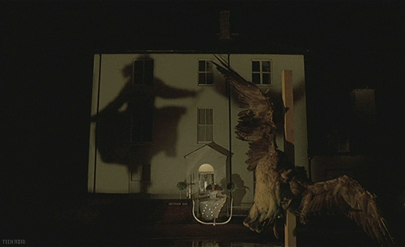
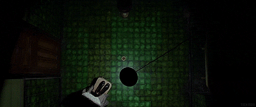
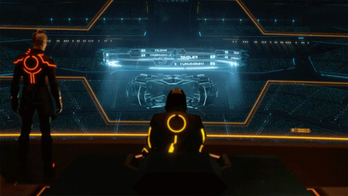
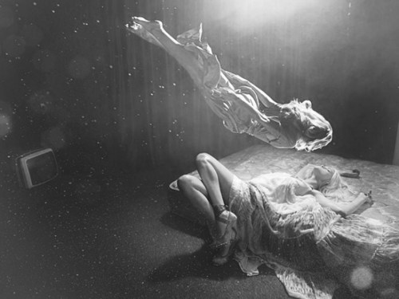
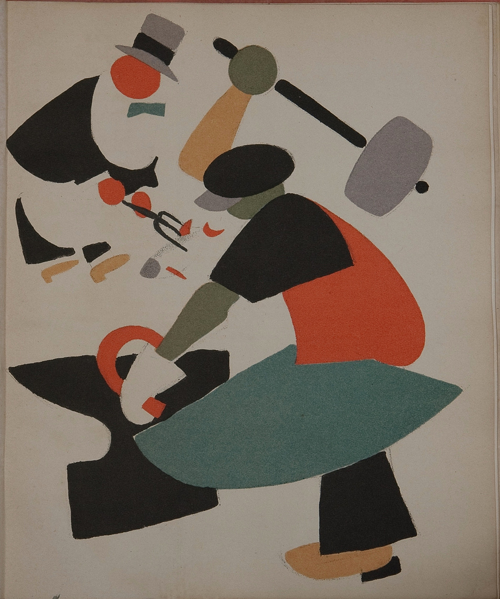
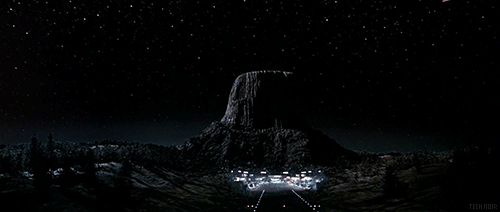
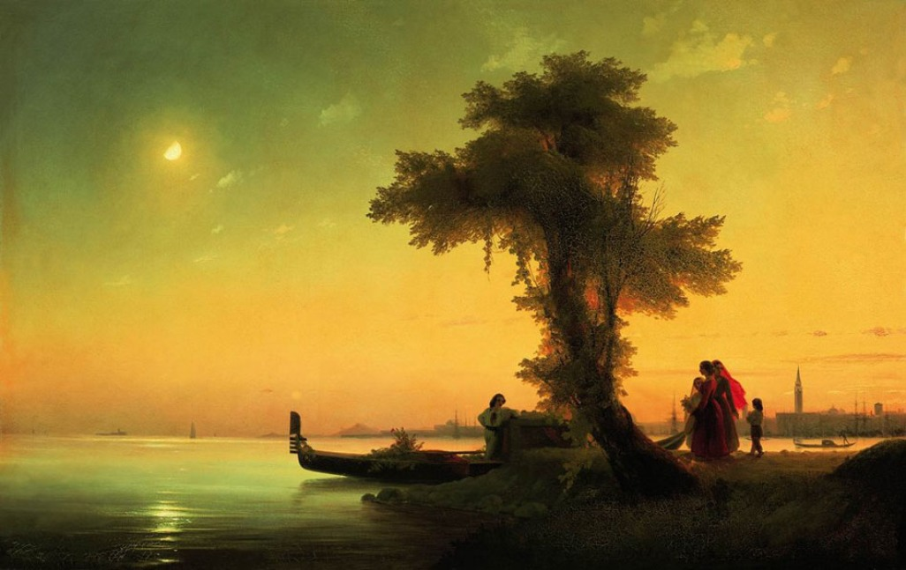
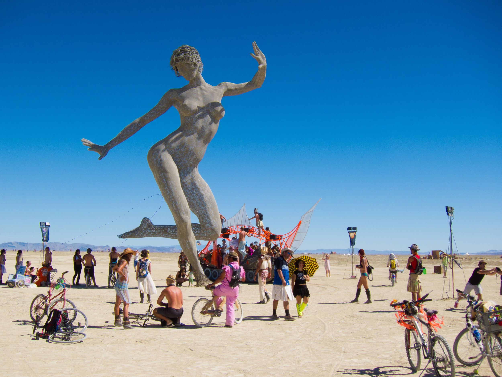
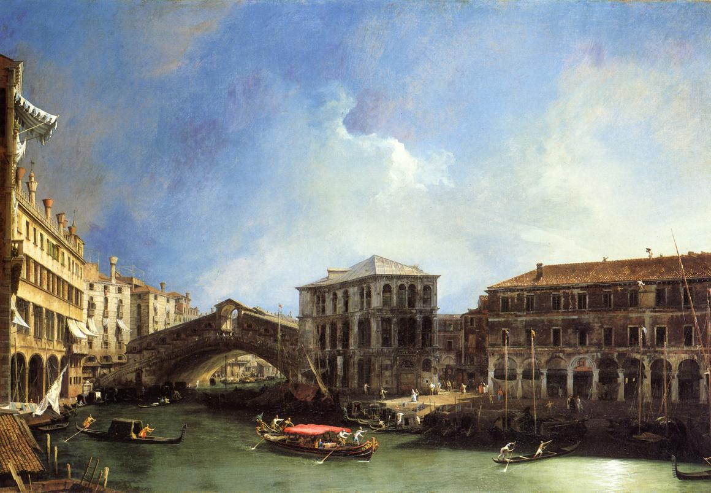

% The Ethics of Ambiguity

[Home](../index.html)>[Philosophy](index.html)

##  Chapter 1 - Ambiguity + Freedom

{:.imgR}

- Fundamental Ambiguity: We are both a being and a consciousness.
    - Most philosophers have tried to _mask_ this ambiguity by turning mind into matter and vice versa.
    - Their ethics have also tried to eliminate this ambiguity.
- Aspects of Ambiguity:
    - Life + Death.
    - Solitude + Bond with world.
    - Insignificance + Sovereign importance of each man.
- We make ourselves a lack of being in order to disclose being.
    - This lack of being is **felt** as a failure.
    - But the disclosure of being is a success.
    - **We must desire the _tension_ created by the lack of being**.
- First implication of this attitude: 
    - Refusal to to recognize **foreign absolutes**.
              - It is the desire which makes the desirable; the project which sets the end. 
- But "everything is permitted" doesn't demolish all ethics.
    - It makes the individual uniquely responsible
    - If god doesn't exist, then man's faults are inexpiable.
- It is false to whine "It doesn't matter what we do" -
    - This presupposed external justification.
    - We make it matter by our acts.
- In freedom is a principle of action whose range is universal.
    - Since freedom is the source of all justification, the man who wants to justify himself must will freedom above all else.
    - To will oneself *moral* is to will oneself *free*.
    - But how can we **will** ourselves free if we already **are** free?
- For some, freedom is solely a **flight from itself**.
    - In laziness, carelessness, capriciousness, and impatience, I contest the meaning of the project at the same moment I define it.
    - I must found the meaning of my acts myself in order for it to justify the transcendence which discloses it.
- I must assume my project positively by adhering to the concrete and particular movement by which this spontaneity defines itself by thrusting itself towards its end.
    - This justification requires a constant tension, a permanent choice.
    - To avoid the anguish of this, I must flee into the object and deny my spontaneity.
- This willing must be developed as a **unity** throughout time.
    - The value and genuineness of the choice is confirmed concretely through **patience, courage, and fidelity**.
    - I can't let the act fall into the past and become an opaque fact 
    - I must return to it and justify it within the unity of the project I am engaged in.
    - To will something is to engage myself to *persevere* in my will.
- This will to freedom must be an _indefinite movement_.
    - Each goal must serve as the point of departure for another goal.

### Freedom and Obstacles

- We don't **create** the world.
    - We only disclose the world through the resistance with which it opposes us.
- The will is defined only by raising obstacles and some do not let themselves be conquered.
    - How can we reconcile this with freedom?
- Resignation (abandoning a goal and renouncing it) condemns the whole part of ourselves that engaged in it to a brute <a href="dictionary.html#facticity">facticity</a>, frozen in the past.
- **My freedom must always aim at an end which is the free movement of existence**.
    - We can renounce a path only if we pass beyond it, towards new possibilities.
    - Releasing our hold to find our hands free to stretch to a new future.
- **If our spontaneity is dispersed without founding anything (in meaningless "busy work") we feel our contingency with disgust**.

## Chapter 2 - Personal Freedom and Others

### The Child

- His situation is characterized by finding himself in a universe which he has not established and which appears as an absolute to which he can only submit.
- Human inventions, words, customs, values are given facts, as inevitable as the sky.
- Even though he is allowed to expend his existence freely in play, he lives in a serious world.
    - Because the domain of his subjectivity seems puerile in his own eyes.
- The real world is that of the adult.
    - He is the naive victim of the mirage of the for-others.
    - He believes in the **being** of his parents and teachers.
    - Their rewards and punishments, words of praise or blame instill in him the conviction that there are a good and evil which exist in themselves.
- The child escapes the anguish of freedom:
    - He feels himself protected against the risks of existence by the ceiling which human generations have built over his head.
    - Some lives slip by in an infantile state because they have never been given the means to break the ceiling over their heads
              - Slaves, women in some cultures.
              - They can only exercise their freedom within the world which has been set up without them.

### Adolescence

- The collapse of childhood.
- Flaws are revealed in the infantile world:
    - He discovers his subjectivity and other's subjectivity.
    - He notices contradictions among adults:
              - Their hesitations and weaknesses.
- He discovers the human character of the reality about him:
    - Language, culture, customs, ethics, and values have their source in these uncertain creatures.
    - And he discovers that he will have to participate in their operation. 
- In adolescence, the child is abandoned to his freedom.
    - **This is the moment of moral choice**.
- We can later reconsider - we are free:

> "But conversions are difficult because the wold reflects back upon us a choice which is confirmed through the world which it has fashioned. Thus, a more and more rigorous circle is formed from which one is more and more likely to escape."

- Because moral choice is free, it is **unforeseeable**.
    - The child sets up his character and universe little by little with a multitude of seemingly insignificant choices, without foreseeing their development.
- "The drama of original choice is that it goes on moment by moment for an entire lifetime."

### The Sub-Man

- Vitality, sensitivity, and intelligence aren't ready-made qualities, they are a way of casting oneself into the wold and disclosing being.
    - Vitality is possible by a free generosity.
    - Intelligence supposes goodwill.
    - Sensitivity is just an attentiveness to the world and the self.
- The lowest kind of man is the one who is lacking in this living warmth.
    - He occupies himself in restraining the original movement of casting oneself into the world.
    - He fears the failure of passion to reach being.

- His choice confirms itself - he discovers only an insignificant and dull world.
- His every action is a flight - he flees from engagement as he does from disengagement.
- He takes refuge in the ready-made values of that serious world
    - To hide his indifference he abandons himself to verbal outbursts + physical violence.
- He realized himself as a blind, uncontrolled force.
- In all of the great bloody movements organized by the fanaticism of the serious, the dirty work is done by recruits from the sub-men.
- He arouses contempt among the free:
    - Ethics is the triumph of freedom over <a href="dictionary.html#facticity">facticity</a>, and he feels only the facticity of his existence.
- He is bewildered before the darkness of the future which is filled with frightful spectres:
    - War, revolution, Bolshevism:
    - The more indistinct, the more fearful.
- What he fears is that the shock of the unforeseen may remind him of the agonizing consciousness of himself.

### The Serious Man

- He forces himself to submerge his freedom in the content given by society.
    - He loses himself in the object in order to annihilate his subjectivity
    - He imagines the accession to these values permanently confers value on himself.
- The reason that this is the most widespread attitude is that we were all once children.
    - After having lived under the eyes of gods and having been given the promise of divinity, it is difficult to accept becoming just a man with all his anxiety and doubt.
- Instead of assuming an affectivity which could throw him dangerously beyond himself, he represses it.
    - Through transference and sublimation, i.e. **dishonesty**.
- What matters isn't the object, but the fact of being able to lose himself in it.
- His dishonesty issues from needing to ceaselessly renew the denial of his freedom.
    - He must mask the movement by which he gives values to himself.
- The less economic and social circumstances allow one to act upon the world, the more it appears as given.
- If one denies the subjective tension of freedom, one forbids oneself to will freedom as an indefinite movement.
    - He no longer seeks goals as points of departure, rather, the goal is cut off and made absolute, a unique end which determines man. 
    - Thus, he accords an absolute value to "usefulness"
- In ignoring the subjectivity of his choice, he ignores value of subjectivity of others
    - They are just means for his end.
    - Thus the serious leads to fanaticism.
- There are some who, outside of their goal/idol, return to sub-men.
    - Having abdicated his freedom, he is no longer capable of existing without a guarantee.
- His choice confirms this:
    - If there is being only in (for example) the army, hos can the military man wish for anything else.

> "No appeal arises from the abandoned zones where nothing can be reveled because nothing has been sown."

- This is why the serious man's life loses all meaning if he is cut off from his ends:
    - He becomes a sub-man, a "has-been".
- The serious man feels dependence upon his object in a state of fear.
    - Thus the first of his virtues is prudence.
    - He escapes the anguish of freedom only to fall into a state of preoccupation, or worry.
- He will always be saying that he is disappointed, for his wish to have the world harden into a thing is belied by the very movement of his life.

### Nihilism

- Sometimes, transcending all goals, freedom wonders, "What's the use?"
- Then the absurd blazes forth, severing all connection with an external goal.
- The nihilist is close to the serious man: he desires to **be** nothing, but a nothingness which is another kind of being.
- Nihilism appears either:
    - At the moment of adolescence, when the child's universe first slips away.
    - Or later, when attempts at fulfillment have failed.
- Nihilist wishes to escape anxiety of freedom by denying world and self.
- Difference between them and sub man is that their rejection is not the original movement.
- He needs the serious world in order to reject it.
- He feels himself as a negation and a freedom:
    - But doesn't realize this as a positive liberation.
- Some forms of nihilism:
    - Perpetual scorn.
    - Adherence to a lost cause because it is lost.
    - Undertaking projects while bent on ruining them.
- The nihilist is compelled to constantly contradict the movement of his existence.
- Instead of defining man as a positive existence of a lack, it defines him as a lack at the heart of existence.
- This desire to reject sometimes takes a positive form in the desire for destruction.
- **He realizes that the world has no justification, but denies that it is up to him to give one.**

### The Adventurer

- Failure of the nihilist: challenging all given values, he doesn't find the absolute end, freedom, beyond them.
- The adventurer likes action for its own sake
    - The zest for existence is experienced in its gratuity.
    - Recognizes his independence and ambiguity - expects no justification from things.
- If existentialism were solipsistic, he would be its perfect hero.
- But even when we consider adventurism in its pure form (i.e. without desires for money or glory) the adventurer doesn't just assert his existence alone, he must declare himself in a human world.
- But the adventurer is indifferent to the human meaning of his action - he thinks he can assert his existence without taking into account that of others.
- He shares the nihilists contempt for men - he will treat them like instruments, and destroy them if they get in his way. 
    - Yet he still needs others - admirers - to retain the meaning of his adventure once it falls into the past:
              - So he writes a book; tells stories
- He refuses to recognize that his subjectivity must transcend itself towards others.
    - He encloses himself in a false independence which is really servitude. 

### The Passionate Man

- He sets up his object as absolute - but not like the serious man, as a thing detached from himself
    - He **asserts** subjectivity of his involvement.
- He doesn't want the object of his passion to be objectively admired
    - He wants her to himself.
- This passion is a disclosure of being
    - It peoples the world with desirable objects and exciting meanings
- But in the maniacal forms of passion, one wants more than disclosure
    - One wants being - the attainment of being
- Nothing exists outside his passion (since everybody else is insignificant) - so nothing can modify his choice.
- But he is never fulfilled - He can't reach being
    - And his freedom is realized only as separation
    - A man who seeks being far from other men, seeks it against them at the same time that he loses himself
- A conversion can happen - the cause of his torment is his distance from his object.
    - But he can learn to accept this as the condition of the object's disclosure.
    - It is only as something strange, forbidden, and free that the other is revealed as other.
    - To love her genuinely is to love him in his otherness and in that freedom by which she escapes.
    - One renounces being in order that there might be being - but this free generosity cannot have just any object.
    - One can choose a painting over its material possession only if it appears as a possibility open to others.
- Passion becomes freedom when one destines his existence to others through the being (thing or man) at which he aims, without hoping to entrap it in the destiny of the in-itself.
- No existence can be validly fulfilled if it is limited to itself - it appears in the existence of others.

### The Critic

- Instead of building their existence upon the indefinite unfolding of time, propose to assert it in its eternal aspect and to achieve it as an absolute (hoping thereby to surmount ambiguity).
- Critic is against all aspects of the serious but without foundering on negation.
    - Sets up a superior, universal, and timeless value - objective truth.
    - Asserts himself absolutely as the independence of the mind
    - Crystallizes negative movement of the criticism of values into a positive reality.
    - But if he doesn't assume subjectivity of his judgement, he is inevitably caught in the trap of the serious.

### Artist and Writer

- Also attempt to realize the existence as an absolute
    - But they don't try to attain being - it is existence which they are trying to make eternal
    - Time is stopped, clear meanings and finished forms arise - existence is confirmed and justifies itself.
- But the creator can be tempted to consider himself to the absolute and enters the world of the serious
- Freedom must protect itself towards its own reality through a content whose value it establishes.
    - An end is valid only by a return to the freedom which establishes it an which willed itself through this end.
    - Freedom can thus not become engulfed in a goal
- This attitude implies a bond of each man with all others.
    - This is not obvious: at every moment others are stealing the whole world from me.
    - But by the same movement of taking away, others are giving the world to me.
- To will that there is being is to will others by and for whom the world is endowed with human significations
- One an reveal the world only on the basis revealed
    - No project can be defined except by its interference with projects of others.
- This is another way of saying that freedom must aim at an open future.
    - Only the freedom of others keeps us from hardening into the absurdity of facticity.
- The me-other relationship as the subject-object
    - Each project emanates from subjectivity, but this movement establishes itself by surpassing subjectivity 
- Man can find justification of his own existence only in the existence of other men.

##  The Positive  Aspects of Ambiguity

### Freedom and Liberation

- Constructive uses of freedom: science, technology, art, and philosophy.
    - Indefinite conquests of existence over being.
    - It is not a matter of approaching a fixed limit, which would be a failure, for the horizon always recedes as we approach it.
    - It is a matter of pursuing the expansion of his existence and of retrieving the very effort as an absolute.
- **Science** finds its truth if in aiming at each discovery not at a fusion with the thing, but at a possibility of new discovery.
- **Technics** - When it sets up objective goals such as saving time and work it appears as absurd.
    - One can't save up existence in a warehouse
    - It exists only by being spent
    - The constructive purpose of technics is a thrusting forward - the transformation of the thing into an instrument and opening up possibilities for man
- **Art** - reveals the transitory as absolute - it reveals existence as the reason for existing
- These are the constructive activities of man - they take on a valid meaning only when they are assumed as a movement towards freedom.
    - But it is a concrete movement
    - Books, discoveries, inventions, industries, people the world concretely and open concrete possibilities to me.
- Most are denied the possibility of constructive activity - they live in a state of oppression.

#### Situation of Oppression

- One's transcendence is condemned to fall back upon itself uselessly, cut off from its goals.
- Oppression is never natural - one can never be oppressed by things.
    - The resistance of things sustains the action of man as the air sustains the flight of the eagle
- Only other men can oppress us, and only because of our interdependence.
    - My freedom requires that it emerge into an open future: it is other men who, setting up the world of tomorrow, define my future and open it up for me.
- If they instead cut off my future; keep me below the level on the basis of which new conquests will be achieved; then living is only not dying - it is indistinguishable from vegetation.
- One of the ruses of oppression is to camouflage itself behind a natural situation.
    - "The distribution of wealth is a natural fact and can't be rejected - one can't reject a hurricane"
    - But the rebel insists that it is a human fact and it is to be rejected.
- There are cases where the slave doesn't know his servitude, and it is necessary to bring the seed of his liberation to him from the outside
    - The slave is submissive when his situation is mystified to the point where it seems a fact of nature and not of men.
    - It is not a matter of hurling him out of his submission, but of putting him in the presence of his freedom and giving him the means of revolt.
    - "What right have we outsiders to destroy his peace?" asks the conservative
- If I want his liberation it is because abstention = complicity = tyranny; and I don't want to be a tyrant, and so that new possibilities will be opened to him, to all men.

- While the cause of freedom is a cause for all, the urgency of freedom is not the same for all.
- The proletariat is no more naturally moral than another.
    - He can flee from freedom, dissipate it, vegetate without desire, or give himself up to mystification.
    - The trick of "enlightened" (i.e. American) capitalism is to make him forget about genuine justification.
    - The worker is offered diversion which peter out his transcendence - sports, gadgets, autos and TV.
- Among the bourgeois intellectuals it is also possible to cooperate in the struggle against oppression.
    - Should they give up the positive, creative use of their freedom (building a better future), or give up all to the struggle?
    - Hard to say, but in any case, every man is affected by the struggle and cannot fulfill himself morally without taking part in it.
- The oppressor claims not to fight in his own name, but for "Civilization", for monuments, institutions, or virtues which realize objectively the situation he seeks to maintain.
    - He defends a past against an uncertain future, he is a conservative.
- Thus some revolutionaries scorn the monuments and traditions of the past.
- But to abandon the past to the night of facticity is to depopulate the world.
- To assert the reign of the human is to acknowledge man in the past as well as the future.
- If the disclosure of being of our ancestors doesn't move us, why should we care about todays?
- On the other hand, the past concerns us not as a brute fact but insofar as it has human signification.
    - It is absurd to uphold against man a datum which is precious only insofar as the freedom of man is expressed in it.
- Oppression can't justify itself in the name of the content which it is defending and has set up as an idol.
    - One doesn't love the past as a living truth if he insists on preserving it in a hardened and mummified form.
- Oppression also tries to justify itself in the name of the future - in terms of utility.
- The oppressor also argues that the respect for freedom is always difficult and one can't respect everyone's freedom at the same time
    - But that just means that man must accept the tension of the struggle 
    - His liberation must seek to perpetuate itself without aiming at an impossible state of equilibrium.

### The antinomies of action

- No action can be generated for men without its immediately being generated against me.
- First against the oppressor
    - Would be more moral to re-educate, but there's no time
    - Because the oppressors refuse to affirm freedom, they embody the absurdity of facticity.
    - Since their subjectivity escapes our control, we will have to act on their objective presence.
    - We will have to treat him as a thing, and the oppressed will be metamorphosed into a blind force.
- Second, against the oppressors accomplices among the oppressed.
    - Mystification is a form of oppression
 
> "Ignorance is a situation in which man may be as narrowly enclosed as a prison"

- One can even need to oppress and kill men who are pursuing goals which are valid because they contradict our own (or so says Simone)
- Violence not only forces us to sacrifice the men in our way, but also those who are fighting on our side, or even ourselves.
    - Since we fight our enemies by reducing them to things, we reduce ourselves to things, expose our bodies to the same danger.
- The nihilistic response to this paradox of action is to declare that the collectivity is all, and the individual is **zero**.
    - When the oppressed is deprived of his transcendence, reduced to pure facticity congealed in his immanence and cut off from his future, he appears as no more than a thing among other things, easily subtracted.
- All repressive regimes become stronger through degradation
- In order to remain capable of perceiving man through these humiliated bodies, one must be sustained by political faith, intellectual pride, or Christian charity.
- This contempt, even at its extreme, can be pieced by the smile of children
    - They remind us that man is a claim on the future
              - They are a living affirmation of mans transcendence.
    - This contempt is also dangerous - the feeling of abjection can confirm men in a hopeless resignation, but cannot incite them to the struggle which is consented to with their life.
- A doctrine which aims at liberation can't rest on contempt for the individual, but it can propose to him no other solution than his subordination into the collectivity. 

### Rationalistic  Optimism

- Hegelian: The substance of life is outside the finite individual and in the infinity of the class or the socialist state.
- A sacrifice is no longer a sacrifice because  an individual is nothing unless he is part of the infinite.
    - But this system subordinates all its moments to an end term which can never happen.
    - If the individual is nothing, society can't be something.
- Both of these efforts fail to evade the bitterness of sacrifice.
- In order for this world to have importance, in order for our undertakings to be worthy of sacrifice, we must affirm the concrete and particular thickness of this world and the individual reality of our projects and ourselves
    - Doctor to Invalid: "Get cured, nothing else matters."
    - Invalid: "If nothing matters, what good is getting cured?"
- This is why democratic societies strive to confirm citizens in the feeling of individual value.
- But in affirming the importance of the individual, the question "why must **I** die, returns in full force.
- Two justifications are given by Authority: Necessity and Utility.

#### Necessity

- The individual's death is no longer a crime, it is fate.
- If only one way is possible, there is no longer any place for the anguish of choice, regret, or outrage.
- This is why historical materialism is so reassuring - there is no place for subjective caprice.
- The voice of the directors merely reflect the fated exigencies of history.
- This is why they cannot hesitate, or doubt, or reflect.
    - Then they would no longer be prophets, merely tyrants.
    - But every regime has opponents, and even when they are in the wrong, they succeed
    - They show that even for the men in power, error is possible.

#### Utility

- Sacrifice is legitimized by finding a rational place within the enterprise
- Utility only has a valid meaning when it is "useful for man"
    - The serious mans mistake is to set up a thing as an absolute and make "useful to the cause" or "useful to the bridge" the justification.
- But for the individual sacrificed, "useful to man" the  same as "useful to this man"?
- No: because of the ambiguity of the human condition: 
    - In his surpassing towards others, each exists absolutely for himself. 
    - Each is interested in liberation for all, but as a separate existence engaged in his own projects.
- Thus to do service to some men we do disservice to others. How do we choose?
- Ultimately, what appears as useful is to sacrifice the less useful man for the more useful.
- But it man is one complement to the word useful, "future" is the other.
- No action is possible without a sovereign affirmation of the future.

### The present and the future

- There are two meanings to the word "future"
    - These two meanings correspond to the two aspects of man's ambiguous condition: being and existence.
- **Existence** - The definite direction of a particular transcendence - the movement which will fulfill my projects.
    - A single temporal form with the present.
- **Being** - the future of the last judgement, or of the completed socialist state, or of Hegel
    - A future of happiness, of the immobility of being,, and abolition of the negative
- Present is fully negative, something which retrieves itself only by transcending itself towards the permanence of the future.
- Therefore any present sacrifice, any indignity is authorized if it helps bring about the perfect future - the end justifies any means.

> "Those who project themselves towards the future-thing and submerge their freedom in it find the tranquility of the serious."

- It is a harmonious future in which reconciled men would fulfill themselves as a pure positivity
- This is not permitted: man is originally a negativity.
    - Nothing can eliminate this lack at the heart of being.
    - It is only by assuming this lack that man can return to positivity.
- There can never be a perfect reconciliation
    - We compete and the world cannot be divided up into little parcels
    - Each individual project is asserted through the world as a whole.
- There will always be opposing choices, the desire to be the being of whom we are a lack, the anguish of freedom
    - Freedom will never be given - it will always have to be won.
- This is the fallacy of parties who justify any abuse because of war.
    - If man waits on peace to justify his existence validly, he will wait forever.
- Man ought not to entrust the care of his salvation to the uncertain and foreign future.
    - it is up to him to assume it within the finite future of his own existence.
- It is in the interval which separates me today from an unforeseeable future that there are meanings and ends towards which to direct my acts.
- These acts, barred from an understanding of a rationalistic history, are always with risks
    - We will never have the perfect knowledge necessary for a perfect choice.
    - The movement of the mind always starts up in darkness, and our acts, being free, always entail risks.
- Thus our acts must aspire to justify themselves, must be lived in their finiteness and considered an absolute, and we cannot hope for future justification.
- A democracy which defends itself only by acts of oppression is denying all of its values.
- The end justifies the means only if it remains present: if it is completely disclosed within the course of the present enterprise.

#### The festival

- And if it is true that men sees in the future a guarantee of their success, it is also true that they feel a need to deny the flight of time and hold the present in their hands.
- Existence must be asserted in the present. 
    - If one doesn't want all life to be defined as an escape towards nothingness.
- This is the reason for festivals - they stop the movement of transcendence and  set up the end as an end

- The festival confirms existence positively as existence.
    - This is why it is characterized by destruction:
    - The ethics of being is the ethics of saving.
    - Existence is defined by consumption - one eats,, drinks, lights fires, breaks things, spends time and money.
    - One seeks both an exaltation of the moment and complicity with other men.
- Of course it cant last - existence realized as pure negativity can't maintain itself.
- Art tries to fix the passionate assertion of existence in a durable way
    - The festival is at the origin of theater, music, dance and poetry
- In the festival and in art, men express their need to feel that they exist absolutely
- what stops them is the realization that every living moment is a sliding towards death.
    - The present must die so that it might live, and must not deny this death.
    - It must assert itself as absolute within its finiteness
- While we can aim at long range goals, we cannot leave justifying them to the future.
    - The tasks we have set for ourselves are ours, and must find their meaning in themselves and not in some mythic historic end.
- But if we reject the future myth for a limited and finite future, we are left with the antinomy of action and the present
    - Failure and sacrifice are no longer compensated for in any point in time.

### Ambiguity

- Ambiguity is not absurdity
    - Absurdity: Existence cannot be made meaningful
    - Ambiguity: Its meaning is never fixed and must be constantly won.
- It is because man's condition is ambiguous that he seeks to save his existence
- Man must assume his finiteness not by treating his existence as transitory or relative but by reflecting the infinite within it - i.e. by treating it as an absolute.
    - This requires that each act be considered a finished form whose different moments, instead of fleeing towards the future for their justification, reflect and confirm one another so well that there is no longer a sharp separation between present and future, between means and end.
    - If these moments are to be considered a unity, there must be no contradiction between them
              - Action cannot seek to fulfill itself by means which would destroy its very meaning.
    - It must not conceal the antimonies between means and end, present and future - they must live in a permanent tension
              - We must neither retreat from the outrage of violence nor take it lightly.
              - Morality resides in the painfulness of an indefinite questioning.

#### Methods

- The individual as such is one of the ends at which our action must aim.
- The abstract will of the revolutionary scorns the tramp enjoying his bottle of wine
    - i.e. pleasures that have no tomorrow.
- But there is a concrete bond between freedom and existence - to will man free is to will the disclosure of being in the joy of existence.
- The movement towards freedom assumes its real flesh and blood figure in the world by thickening into pleasure and happiness
- If we take no satisfaction in this then our will to freedom is only a hollow myth.
    - On the other hand, we must reject those who thoughtfully sacrifice the future to the present.
    - If the addict asks for our help to finds drugs, what do we do?
    - We try to make him aware of his error and put him in the presence of his freedom, but what if he persists? Shouldn't we use violence?
- Violence is only justified if it opens concrete possibilities.
- When I use violence to save someone I am assuming an engagement to others, the suicide I pull out of the river has the right to ask me for means and reasons for living.
- What makes the situation so complex is that, on the one hand, one must not make oneself an accomplice of that flight from freedom that is found in heedlessness, caprice, mania, and passion, while on the other hand, it is the abortive movement towards being which is his very existence.
    - We object to all those who want to create virtue and happiness from without, 
              - Who want to prohibit man from certain possibilities of temptation.
              - Whereas what is necessary is to give reasons for resisting it.
- Violence is not immediately justified when it opposed willful acts which one considers perverted.
- Thus, while the good of an individual or group of individuals requires that it be set up as an absolute end of its own action
    - But we are not authorized to decide upon this end a priori.
    - Treat the other as a freedom in order that his end may be freedom.
              - But this will incur the risk of inventing an original solution for each case. 
- Suppose an individual lives in a situation of falsehood - a falsehood of violence or tyranny.
    - Should I tell the truth in order to free him?
    - Only if you can create a situation in which that truth is bearable.
- What makes it more complex is that the freedom of each man usually concerns other individuals.
- Kant implores us to treat the other as an abstract universal form of man
    - But generosity seems better grounded (and more valid) the less distinction there is between the other and ourself.
- It is fitting that the Spaniard fight for Spain and the proletarian for the proletarian
    - But this shouldn't contradict the will fro universal solidarity
    - Each finite undertaking must at least be open to the totality of men
- How do we decide when we need to choose between freedoms.
- First: Always consider what genuine human interest fills the abstract form one proposes as the action's end.
    - We don't want to fight for "Nation," at the expense of all the actual individuals who make it up.
    - We repudiate all mysticisms, idealisms, etc which prefer a Form to man himself
- We challenge every condemnation as well as every a priori justification of the violence practiced with a view to a valid end.
    - They must be legitimized concretely.
- Political choices are ethical choices - they are wagers as well as decisions.
- The method being proposed consists in confronting **the values realized** with **the values aimed at**
    - And the **meaning of the act** with its **content**

> "An action which would serve man ought not to forget him along the way; if it chooses to fulfill itself blindly, it will lose its meaning or take on an unforeseen meaning; for the goal is not fixed once and for all; it is defined along the road which leads to it.

- The inextricable confusion between subjectivity and objectivity in ethics:

> A man gives himself to a Cause only by making it *his* cause; it is also through him that it is expressed, and the will to power is not distinguished in such a case from generosity; when an individual or a party chooses to triumph, whatever the cost may be, it is their own triumph which they can take for an end.

- Ethics can never follow the path of least resistance.

## Conclusion

- This ethics is individualistic
    - in that it accords the individual an absolute value
    - and it recognizes in him alone the power to found his existence.
- But it is not solipsistic
    - The individual is defined only in relationship to his world and others
    - He exists only by transcending himself
    - His freedom requires the freedom of others.
- Existence is justified by a movement which springs from the heart but leads outside him.

- Man is free, but finds his law within that very freedom.
- It is a matter of reconquering freedom on the contingent facticity of existence.
    - Of taking the given (which *is there* without any reason) as something **willed by man.**
- A conquest of this kind is never finished - the contingency always remains
    - So isn't this just a chasing after an ever-receding illusion on a treadmill?
    - Is this illusion of progress just a "turbulent stagnation"?
- But this path is meaningful so long as we will it to be. 
    - It can't be a lie or an illusion, since we create the criteria for true and false.
- Our necessary finiteness is what grounds the value of our life.
- Existentialism offers no evasion

> Regardless of the staggering dimensions of the world about us, the density of our ignorance, the risks of catastrophes to come, and our individual weakness within the immense collectivity, the fact remains that we are absolutely free today if we choose to will our existence in its finiteness, a finiteness which is open to the infinite.

