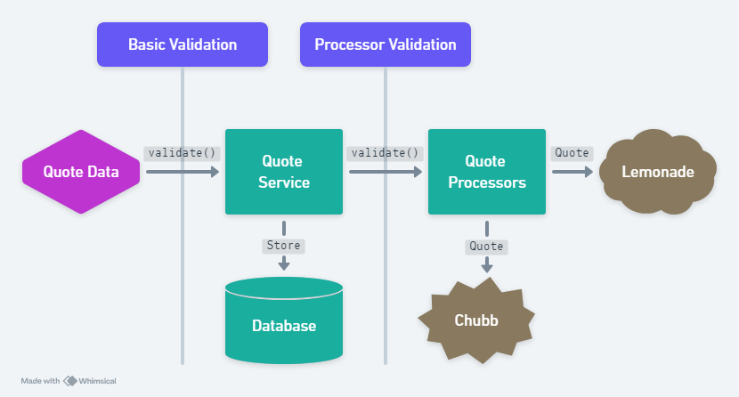

# Validation Configuration
{:.no_toc}

<nav>
* A markdown unordered list which will be replaced with the ToC, excluding the "Contents header" from above
{:toc}
</nav>

## Intro

In a basic spring application, validation can be accomplished purely with
annotations - `@Validation` annotations on fields define the acceptable values,
`@Valid` on the intake of an object will trigger the running of validations.

Our `Quote`, however, has a need for varying validations, depending on which
insurer we are retrieving a quote from. Chubb requires a large number of
fields, but Lemonade requires relatively few.

Furthermore, there are some **complex** validations involving multiple fields
or detailed evaluations which also need to be accommodated by the system.


## Validation Phases

Quotes are checked for validity in two distinct phases during the processing:

1. Basic Validation on intake.
2. Processor-Specific validation prior to transmitting to raters.



**Basic Validation on intake.**

- In this stage, we perform universal checks for data validity: dates and
  emails are formatted properly, universally required data is present.
- The "default" validation group used for these rules (see "Validation Groups" below).
- The goal is to avoid storing malformed data in the database.

**Processor-Specific validation**


- These are run just prior to transforming the Quote into the appropriate interface data.
- Each external rater has a custom implementation of `IQuoteProcessor` which
  defines the set of validations required by that rater.
- In cases where multiple processors are used (e.g. the customer wants both
  a Lemonade and a Chubb quote), then validation failures from one processor
  won't prevent rating by the other.

## Validation Categories

Validations in the application fall into two basic categories: 

1. **Annotation based** 
    - These are simple jakarta validation annotations, e.g. `"@NotBlank"`
    - Processor-specific validations are supported with "Validation Groups"
      (see below).
2. **Custom (code-based)**
    - These are embedded in java code and perform any complex validations
      involving multiple fields or detailed evaluation.
    - Classes which perform validation must implement the `ICustomQuoteQuoteValidator` interface.

## Validation Groups

To support processor-specific validations using annotations, we need to use
validation groups. This is an additional property added to the validation:

```java
  @NotBlank(message = "Insured type is required.", groups=ChubbGroup.class)
  String insuredType
```

A validation which has no group specified is considered part of the "Default"
group. These comprise the "Basic Validations" which are run on intake of the
quote.

Validation groups are implemented as empty, marker interfaces in the codebase.


### Current Validation Groups

Each validation should be assigned (in its annotation) to one of these, unless
it is a Basic validation we want to run on intake, in which case no group is
required.

- `ComprehensiveQuote.java` - Meant to be a catch all for validations which are
  used for the complex raters like Chubb. When we add another rater who
  requires many fields and validations, this will be the grouping for the
  shared validations.
- `ChubbQuote.java` - Validations which are definitely unique to Chubb - e.g.
  the limitation to certain states.
- `LemonadeQuote.java` - Validations which are definitely unique to Lemonade.

To add additional groups, simply add a new marker interface and then use the
group in the appropriate annotations.


## Custom Validators

Some validations are too complex for annotations and require java code. These
code-based validations should be contained in an implementation of the
`ICustomQuoteValidator` class.

### Current Custom Validators

- `BasicValidator` 
    - This is run on intake and contains any universal validations.
    - Validation: birthdate must be > 18 years.
- **ChubbValidator**
    - This is run on processing and contains complex Chubb validations
    - Sample Validations: 
        - Square footage required for house risk type.
        - Occupation and Occupation Details match Chubb's list of valid occupations.
        - Contents amount is a multiple of 1000.

## Validation Configuration


The two validation categories - Custom Validators, and Validation Groups
- require a hard-coded association with a processor. Each `IQuoteProcessor` has
a method: 

```java
    List<Class<?>> getValidations();
```

This returns a collection of classes which are **either** Validation Groups
(e.g. `LemonadeQuote.class`), or a Custom Validator (e.g.
`ChubbValidator.class`). For example:

```java

    @Override
    public List<Class<?>> getValidations() {
        return List.of(ChubbQuote.class, 
                       ComprehensiveQuote.class, 
                       ChubbQuoteValidator.class);
    }
```

The class `ValidationProcessor` collects the varying validaitons for
a particular Quote Processor and runs them, prior to quoting.


